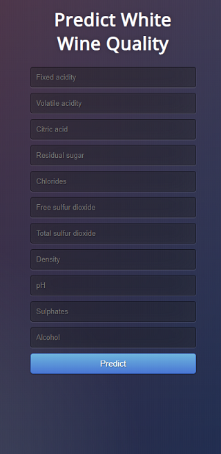
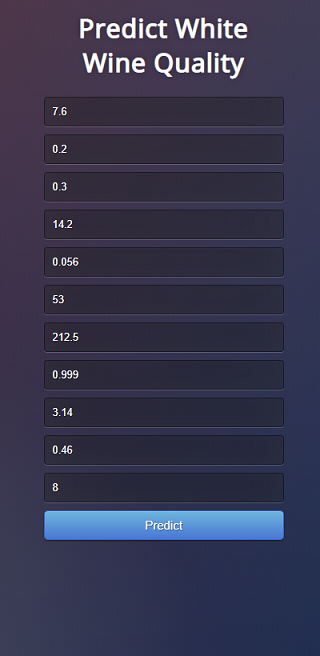
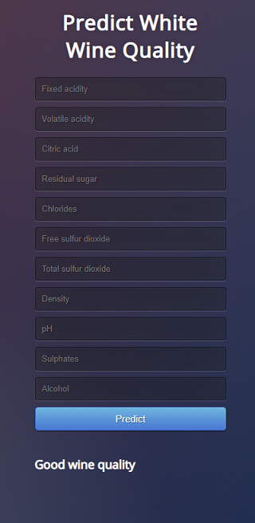

## Wine_quality_prediction
This is a web application with Flask, which predicts the quality of white wine based on its 
physicochemical properties using the Bagging classifier algorithm.

Using the form to fill out the wine characteristics, you need to enter the values and click the "Predict" button. 
The features will then be forwarded to the machine learning model to evaluation.
After that you will get the result of the white wine quality evaluation.

**Input variables (based on physicochemical tests):**
- fixed acidity
- volatile acidity
- citric acid
- residual sugar
- chlorides
- free sulfur dioxide
- total sulfur dioxide
- density
- pH
- sulphates
- alcohol

**Output variable (based on sensory data):**
- quality (Bad, Average, Good)

### Technical Requirements
The codebase is implemented in Python 3.6.8 package versions used for development are just below.
- numpy 1.16.2
- pandas 0.24.2
- scikit-learn 0.22
- seaborn 0.9.0
- imblearn 0.0
- torch 1.1.0
- joblib 0.14.0
- Flask 1.1.1

The required Python libraries used can be installed from the included requirements.txt file:
```
pip install -r requirements.txt
```

### Project Structure
1. **data_analysis.ipynb** - Primary data analysis.
2. **sklearn_wine_quality.ipynb** – Analysis of ML algorithms, selection of the best one and saving the model.
3. **pytorch_wine_quality.ipynb** – Multilayer Perceptron Classifier using Pytorch.
4. **api.py** – Flask APIs, which obtain values of physicochemical properties of wine through 
GUI or API calls predict the quality of the wine based on our model and return the estimate.
5. **templates** - This folder contains the HTML template to allow user to enter wine properties and displays the predicted wine quality.
6. saved_models – Folder with saved models for use in GUI and API.

### Running the application locally
#### Directly
Run api.py using below command to start Flask API
```
cd Wine_quality_prediction
python api.py
```
By default, flask will run on port 5000.
#### On Docker
```
cd Wine_quality_prediction
docker pull alenaefremova/wine_quality_prediction:v1
docker run -it -p 5000:5000 alenaefremova/wine_quality_prediction:v1
```

#### Testing the application
Navigate to URL http://0.0.0.0:5000/ or http://name-your-pc:5000/

You should be able to view the homepage as below



Enter the wine characteristics like this and hit Predict:

 

If everything goes well, you should  be able to see the predicted wine quality on the HTML page!



#### Test with Postman
Once it is running, the API can be queried using HTTP POST requests. 
This can be done through a GUI REST client like [Postman](https://www.getpostman.com/).

URL: ```http://0.0.0.0:5000/predict_api```


Example:
 ```
[
	{"fixed_acidity": 8.4, "volatile_acidity": 0.29, "citric_acid": 0.29, "residual_sugar": 1.05, "chlorides": 0.032, 
	"free_sulfur_dioxide": 4, "total_sulfur_dioxide": 55, "density": 0.9908, "pH": 2.91, "sulphates": 0.32, "alcohol": 11.4},
	
	{"fixed_acidity": 6.7, "volatile_acidity": 0.37, "citric_acid": 0.41, "residual_sugar": 6.3, "chlorides": 0.061, 
	"free_sulfur_dioxide": 22, "total_sulfur_dioxide": 147, "density": 0.9953, "pH": 3.16, "sulphates": 0.47, "alcohol": 9.6},	

	{"fixed_acidity": 7.3, "volatile_acidity": 0.25, "citric_acid": 0.36, "residual_sugar": 13.1, "chlorides": 0.05, 
	"free_sulfur_dioxide": 35, "total_sulfur_dioxide": 200, "density": 0.9986, "pH": 3.04, "sulphates": 0.46, "alcohol": 8.9}
]
 ```
Result:
 ```
{
  "prediction": "[0, 1, 2]"
}
 ```